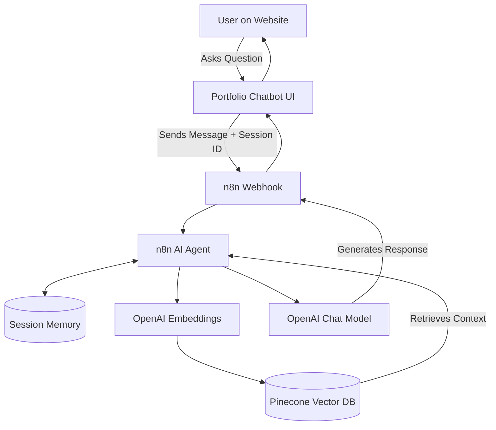

<div align="center">
  
</div>

<h1 align="center">🚀 Personal Portfolio with RAG-Powered AI Chatbot</h1>

<p align="center">
  <strong>An end-to-end AI-powered portfolio built with n8n, OpenAI, Pinecone, and modern web technologies.</strong>
</p>

<p align="center">
  <a href="#-overview">Overview</a> •
  <a href="#-key-features">Key Features</a> •
  <a href="#-system-architecture">Architecture</a> •
  <a href="#-tech-stack">Tech Stack</a> •
  <a href="#-setup--installation">Setup</a>
</p>

---

## 📌 Overview

Welcome to my personal portfolio repository! This isn't just a static website; it's a **production-ready Generative AI system**. The portfolio features a built-in AI assistant that uses a **Retrieval-Augmented Generation (RAG)** architecture to answer questions about my experience, skills, and projects based *strictly* on verified personal data. 

No hallucinations. No guessing. Just accurate information retrieved from my resume, GitHub, and LinkedIn profile.

---

## ✨ Key Features

- **🤖 RAG-based AI Chatbot**: Context-aware AI assistant embedded directly in the UI.
- **🔗 n8n AI Agent Orchestration**: Automated workflows to manage queries and responses.
- **🧠 Pinecone Vector Store**: High-performance semantic search for knowledge retrieval.
- **🧬 OpenAI Integration**: Utilizing advanced embeddings and chat completion models.
- **💬 Session-Based Memory**: Supports multi-turn conversations for a natural chat experience.
- **🎨 Beautiful UI**: Responsive, glassmorphic design with smooth 3D animations and parallax effects.

---

## 🧠 System Architecture



---

## 🛠️ Tech Stack

### Frontend
- **HTML5 / CSS3 / JavaScript (ES6+)**
- **Tailwind CSS** (for rapid, responsive styling)
- **Vite** (for fast local development and building)

### Backend & AI Infrastructure
- **n8n**: Workflow automation & AI Agent orchestration
- **OpenAI API**: Generating embeddings and chat completions (LLM)
- **Pinecone**: Vector database for the RAG knowledge base
- **Webhooks**: Secure communication between frontend and backend

---

## 📂 Project Structure

```text
├── index.html                 # Main portfolio layout and content
├── main.js                    # Core logic (UI animations & Chatbot integration)
├── style.css                  # Custom styling overrides
├── package.json               # Project dependencies and scripts
└── README.md                  # Project documentation
```

---

## 🚀 Setup & Installation

### 1. Clone the repository
```bash
git clone https://github.com/Sujalkumar123/Personal-Portfolio-Rag-Model.git
cd Personal-Portfolio-Rag-Model
```

### 2. Install Dependencies
Ensure you have [Node.js](https://nodejs.org/) installed, then run:
```bash
npm install
```

### 3. Run Locally
Start the Vite development server:
```bash
npm run dev
```
Open the provided local URL (usually `http://localhost:5173/`) in your browser to view the portfolio.

---

## 🔧 AI Configuration (Backend)

To run the backend AI logic:
1. Import the RAG workflow into your **n8n** instance.
2. Add your **OpenAI** and **Pinecone** API credentials in n8n.
3. Update the webhook URL in `main.js` to point to your production n8n webhook.


---

## 👤 Author / Contributor

**Sujal Kumar**  
- **GitHub**: [Sujalkumar123](https://github.com/Sujalkumar123)
- **Repository**: [Personal-Portfolio-Rag-Model](https://github.com/Sujalkumar123/Personal-Portfolio-Rag-Model)

---

<div align="center">
  <i>Built with ❤️ using n8n, OpenAI, Pinecone, and Vite.</i>
</div>
